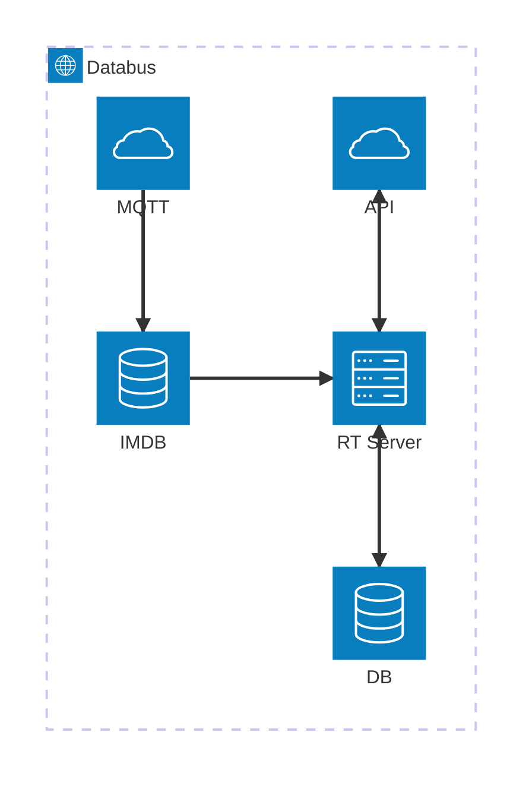
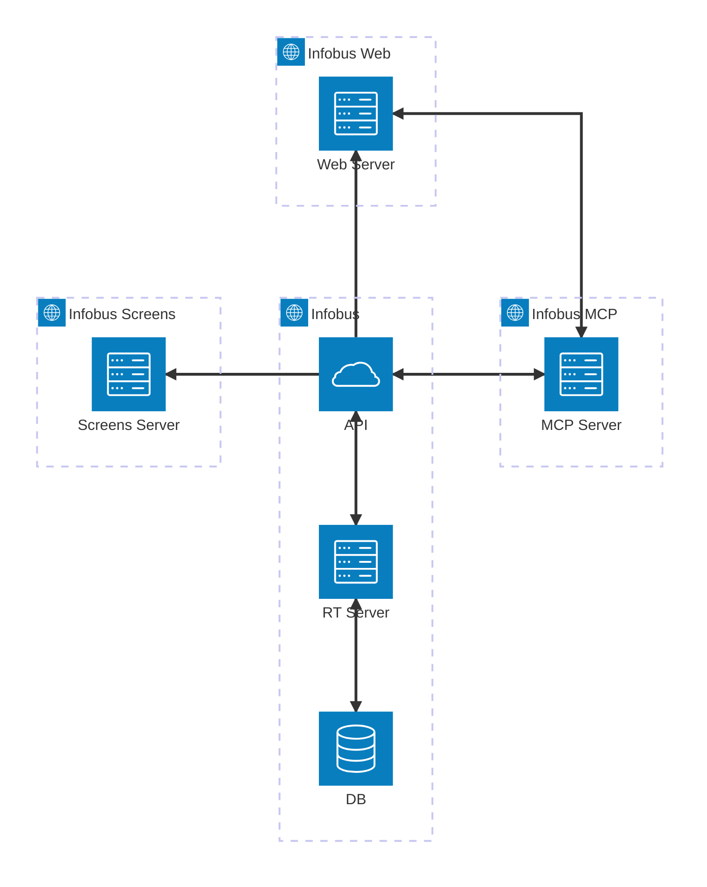

# Architecture

## Databús

```mermaid
architecture-beta
    group dab(internet)[Databus]

    service rt(server)[RT Server] in dab
    service db(database)[DB] in dab
    service imdb(database)[IMDB] in dab
    service broker(cloud)[MQTT] in dab
    service api(cloud)[API] in dab

    broker:B --> T:imdb
    imdb:R --> L:rt
    rt:B <--> T:db
    api:B <--> T:rt
```

## Infobús

```mermaid
architecture-beta
    group inb(internet)[Infobus]
    group web(internet)[Infobus Web]
    group screens(internet)[Infobus Screens]
    group mcp(internet)[Infobus MCP]

    service rt(server)[RT Server] in inb
    service db(database)[DB] in inb

    service api(cloud)[API] in inb

    service webserver(server)[Web Server] in web

    service screensserver(server)[Screens Server] in screens

    service mcpserver(server)[MCP Server] in mcp

    api:B <--> T:rt
    rt:B <--> T:db
    api:R <--> L:mcpserver
    api:L --> R:screensserver
    api:T --> B:webserver
    webserver:R <--> T:mcpserver
```

## Infobús Admin
