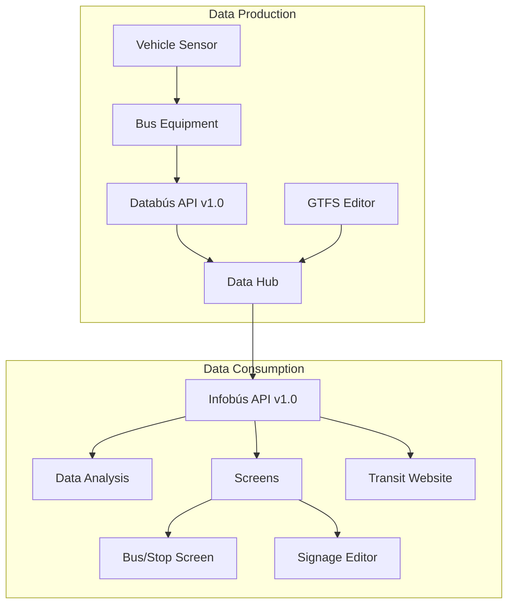
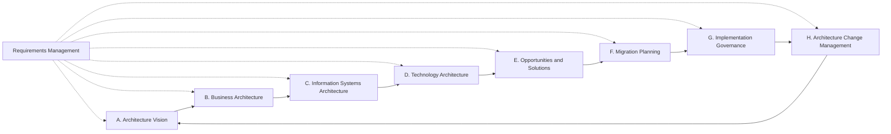

# A System-Level Design for a Public Transportation Information System in Costa Rica

## Abstract

Service information for passengers is a major factor in promoting public transportation use and enhancing user satisfaction. Implementing a comprehensive digital information system for travelers is a complex task that requires expertise in Intelligent Public Transportation Systems and, more broadly, in developing Enterprise Architectures. Costa Rica currently lacks diagnoses or plans for a large-scale implementation of such systems. In this paper, the contributions are, first, an overview of the application of digital technologies in the transit system in Costa Rica, and second, a set of design principles and architectural decisions that are relevant to transit information systems and are specifically tailored for deployment in Costa Rica. For this purpose, this work adopts the Architecture Development Method (ADM) cycle, as proposed by The Open Group Architecture Framework (TOGAF), along with reference architectures and data specifications such as the Architecture Reference for Cooperative and Intelligent Transportation (ARC-IT), the General Transit Feed Specification (GTFS), and the Smart Data Models framework, among others.

## Introduction

An effective and robust public transportation system is widely acknowledged as a key factor for fostering socioeconomic development and protecting the environment (ONU, 2021; Ceder, 2020; Perallos et al., 2015).

Contemporary transit systems are a high-tech industry that produces massive amounts of real-time data sourced from agencies, vehicles, travelers and infrastructure (Zhu et al., 2019). In particular, Advanced Traveler Information Systems (ATIS) employ a diverse set of Information and Communication Technologies (ICT) to enhance the user experience by providing readily accessible service information. The primary purpose of this data is to support multimodal travel planning applications for passengers (Eros et al., 2014) and other digital interfaces like screens or web pages (Jaffe, 2017) to help travelers make informed decisions (Singh et al., 2015).

ATIS data is now available for public use and easily accessible in standardized formats through open interfaces and technologies in most of the biggest cities around the world (MDIP, 2023), creating significant social and economic value (Deloitte, 2017).

To accomplish the purpose of deploying a complex and heterogeneous system capable of producing, managing and delivering data such as the described, it is advisable to consider the concept of Enterprise Architectures (EA), which offers a more rigorous approach to aligning business needs with ICT requirements (Kotusev, 2018; Hermawan et al., 2019). In this context, a System-Level Design (SLD) proposal is presented in this paper to address the most significant challenges for such systems.

### Situation in Costa Rica

In Costa Rica, the transit system is responsibility of the Ministry of Public Works and Transportation (MOPT, _Ministerio de Obras Públicas y Transportes_), which delegates the management tasks to the Public Transportation Counsel (CTP, _Consejo de Transporte Público_), both of them called _governing bodies_ in this paper. The operation of the routes is given by concession to private companies (Semanario, 2019), collectively called _concessionaires_. The regulation is made by the Public Services Regulatory Authority (ARESEP, _Autoridad Reguladora de los Servicios Públicos_) (ARESEP, 2016), herein called the _regulatory body_.

Several interviews were conducted with personnel from CTP, MOPT, ARESEP, and other relevant entities to gain a better understanding of the existing technology infrastructure and planning. The findings indicate that there is no technical unit responsible for the high-level, system-wide design of an ICT architecture for the service. The current ICT departments are primarily operational and focused on supporting routine administrative tasks.

Digital technologies in the public transportation system are mostly absent from the assessments and technical reports of the last decades (MOPT, 2017) in Costa Rica. For example, the landmark Program for an Integrated Mass Public Transportation System for the Greater Metropolitan Area (SITGAM, _Programa para un Sistema Integrado de Transporte Público Masivo para la GAM 2020 - 2035_) only mentions "technology" in the sense of technologies for electric motors (MOPT, 2020). In other cases, the references are limited to a subset of technologies and services, like electronic payment or simpler geolocation systems for buses, as seen in the State of the Nation Program (PEN, _Programa Estado de la Nación_) report on public transportation (PEN, 2023) or in Agüero et al. (2021), without details about its design or implementation.

Existing initiatives include the project by the CTP for the acquisition of a Geographic Information System (GIS) for storing data about routes and stops (CTP, 2020), which is a significant step in the direction of modernization of the system, although its data is still not available for passengers. In 2018 it was also deployed a tracking system for hundreds of buses (Cordero-Parra, 2018) but the data was not accessible for users and its use slowly declined, according to the interviews, highlighting the difficulties for implementation in the current environment and without a clear and more comprehensive vision of the digitalization process.

## System-Level Design

The technology diagram in Figure 1 is the system-level design proposed in this paper for an information platform in an Intelligent Public Transportation System (IPTS) in Costa Rica, featuring an on-board and at-stop visual information system for passengers, which is compatible with other digital media, like websites and mobile applications using standardized data.

**Figure 1: A technological diagram showing the main subsystems and components of the information system and their interfaces, designed around the production and consumption of GTFS data for distribution to own and external information services. The data production subsystem in this paper is called _Databús_ and the data consumption subsystem is called _Infobús_, both registered trademarks of the University of Costa Rica.**

The main subsystems of the proposed architecture are described in Table 1.

**Table 1: Subsystems in the information system**

| Subsystem        | Type                 | Description                                                                                              |
| ---------------- | -------------------- | -------------------------------------------------------------------------------------------------------- |
| Vehicle Sensor   | Electronic equipment | Collects sensing data from the vehicle, including location, occupancy, emissions, conditions, and others |
| Bus Equipment    | Interface and comm.  | Provides an interface for the vehicle operator and collects and sends real-time data to the server       |
| Databús API v1.0 | RESTful API          | Defines the telemetry and tracking data required for the deployment of multiple information services     |
| Databús          | Web server           | Collects and periodically creates GTFS _Realtime_ feed messages                                          |
| GTFS Editor      | Admin panel          | Provides a user interface for creation and edition of GTFS _Schedule_ with maps and data validation      |
| Data Hub         | Web server           | Collects GTFS _Realtime_ and other data to serve multiple connected information services                 |
| Infobús API v1.0 | RESTful API          | Defines the data that is provided to information services like websites, apps or screens                 |
| Data Analysis    | Web server           | Collects and processes data from GTFS and other sources for research and planning purposes               |
| Screens          | Web server           | Retrieves, organizes and distributes information to screens in vehicles and stops                        |
| Transit          | Website              | Shows static and real-time information of the service from GTFS data                                     |
| Bus/Stop Screen  | Screen or TV         | Controls the screens to show browser-based information for passengers                                    |
| Signage Editor   | Web editor           | Programmatically creates signage with given graphic design specifications                                |

The development presented here employs the Architecture Development Method (ADM) cycle, proposed by The Open Group Architecture Framework (TOGAF), which is a well-established and extensive process for Enterprise Architecture design. The methodology follows the iterative process described in Figure 2.

ADM is generic in scope but can be adapted to specific industries, as it is presented here. The proposal is explained through the design principles in Section 3 and the design phases in Section 4.

### Scope of the architecture

In terms of breadth, this work focuses on a transit information system in Costa Rica, which is only a subset of an intelligent public transportation system, itself a subset of the broader concept of smart cities (Karimi et al., 2021). Nevertheless, it is taken into account that this design should be effectively part of a "system of systems" in the future, with many interconnections within and outside the public transportation realm.

Regarding the depth of the architecture, we are presenting here a description of the functionality and interfaces of each component or software system, without details about the implementation or deployment. This is deemed important as the specific technologies for implementation, especially in fields like telecommunications and web technologies, can vary significantly in a matter of years, well within the expected life-cycle of the system.

In terms of a time period for the architecture, this proposal is for the short and mid term, under the premise that the proposed system can be deployed gradually, with an operative pilot plan finished in one to two years.

## Design Principles

This paper proposes the following _ten principles of design_, which are considered relevant for the application of digital technologies in a public transportation information system in Costa Rica. They are separated into the four dimensions defined by ADM: business, data, application and technology principles.

### Business Principles

#### Maximize Benefits for Users

- **Statement**: A public service should prioritize the continuous improvement of its users' experience.
- **Rationale**: The economic and social benefits of technologies for public transportation derive, ultimately, from the effectiveness and convenience that it provides to its users.
- **Implications**: Continuous upgrades of the information system should be made to better address the evolving needs of its passengers.

#### Financial Sustainability and Service Affordability

- **Statement**: The implementation of new technologies must ensure proper funding so that the financial risks for the private companies, as service providers, are minimized, while keeping the costs for passengers reasonable.
- **Rationale**: Without a sustainable business model, the concession model of public transportation in Costa Rica cannot exist and, in fact, the service itself is threatened, as exemplified by several routes that are currently abandoned for the lack of companies willing to assume the operation. New operational costs derived from these technologies would worsen the situation, regardless of how useful and important they might be.
- **Implications**: The system design should be carefully planned to enable a gradual, low initial cost implementation. New legislation could be discussed to make structural changes related to, for example, the funding mechanisms for new technologies. Subsidies should also be discussed, as suggested by many technical entities.

### Data Principles

#### Service Data is Open and Standardized

- **Statement**: All data related to the service that should be provided to passengers to facilitate system usage must be open and readily accessible for public consumption.
- **Rationale**: There is an obligation for the providers of a public service to be clear and transparent about all the information that its users need to effectively make use of it, while there is an obligation of the governing bodies to coordinate the effort for sharing open and standardized transit data (TUMI, 2024).
- **Implications**: The governing bodies will create the appropriate channels for sharing open data, including a technology architecture that allows sustainable evolution of the systems, available without restrictions for consumption and analysis by any interested party, including private companies, researchers, the press and others.

#### Operational Data is Shared

- **Statement**: Operational data is an asset for multiple stakeholders of the system and should be accessible for efficiency, regulation and continuous improvement.
- **Rationale**: The concession of a public service requires close inspection from governing and regulatory bodies. For this purpose, operational data is important and valuable for assessing the effectiveness and legal compliance of the company, which is in the highest public interest.
- **Implications**: The governing and regulatory bodies must rule what data needs to be shared with them. The data to be shared (occupancy, emissions, etc.) --although not necessarily publicly-- will help in examining, regulating and improving the service.

#### Common Vocabulary and Data Definitions

- **Statement**: All technological components of the system will follow a single set of concepts and definitions.
- **Rationale**: A complex technological system requires consistency among its components on the understanding of its definitions, elements and relationships. This will allow an easier expansion and integration with smart cities, in general.
- **Implications**: All databases and internal data exchanges must follow, as closely as possible, the definitions of any pre-defined, applicable standards. Service data and operational data either share a common vocabulary and data definitions or have a well-defined mapping function, avoiding duplicity or confusion in cases where legacy or external systems are included.

### Application Principles

#### Unicity of the Information

- **Statement**: The information available to the users is consistent, accurate, up-to-date and single-sourced, via as many communication channels as possible.
- **Rationale**: Passengers require information of the public transportation system as a whole. Currently, in Costa Rica, every private concessionaire is responsible for sharing the information of its service, resulting in a severe lack of availability, with less than 15% of the routes presenting complete and consistent data online (Abarca et al., 2024) and without any clear guidance on how to share this information.
- **Implications**: All concessionaires will follow the requirements for data collection and data sharing established by the governing bodies. This does not limit who can collect and share this data --for example, third-party ICT private companies-- but the technical details are previously established.

#### Ease-of-Use and Accessibility

- **Statement**: The service should be designed for all users.
- **Rationale**: Modern technological systems must be sensible to the needs of special users with different physical and cognitive abilities or background knowledge.
- **Implications**: Recommendations in service design must be followed for ensuring accessibility in graphic signage, digital media, communication strategies, and other "touch points" between the system and the users. The system should also follow from the start an internationalization (i18n) process by providing information that is understandable for most international visitors, given the importance of tourism and migration in Costa Rica. For example, translations should be made to, at least, English for wayfinding signage, alerts and other data in print and digital media. New generative artificial intelligence technologies like large language models (LLM) could and should be used to expand these capabilities.

### Technology Principles

#### Single System Architecture

- **Statement**: All stakeholders should follow and comply with the guidelines of a system-wide architecture devised by the governing bodies.
- **Rationale**: A complex system requires a well-defined blueprint to evolve more seamlessly. The internet is an essential example of a vast, intricate system with a multitude of applications and technologies, all coordinated through a set of standards and architectures. The new paradigms of design of engineering systems demand interventions with careful considerations of the complexities of a socio-technical system like public transportation.
- **Implications**: Governing bodies should function as technology planners, product owners and referees, and must develop the technical expertise required for these roles. However, in designing such an architecture, careful attention must be given to ensure it does not become an obstacle to future modernization and interoperability.

#### Technology Independence

- **Statement**: Implementations should be independent of particular technology choices, allowing them to function on multiple platforms and alongside external systems.
- **Rationale**: Technology independence results in flexibility, scalability and cost-effective implementations, while minimizing the risk of obsolescence. The accessibility and compatibility to different technology options is increased, as well as the innovation and resilience of results.
- **Implications**: Standards must be followed at major steps of the implementation. Critically, government bidding processes must add this in their requirements.

#### Interoperability

- **Statement**: Implementations should follow established standards to ensure compatibility and effective information exchange between systems.
- **Rationale**: This approach enhances efficiency by allowing seamless integration of different technologies. It reduces costs by using existing infrastructure, and fosters innovation through collaboration. Adhering to standards also ensures consistency and improves system management, while maximizing return on investment and supporting vendor integration and supply chain efficiency.
- **Implications**: A protocol for devising or adopting and reviewing relevant standards is needed. Current platforms must be identified and documented. Standards should be followed unless there is a strong business case for deviation. A digital governance mechanism should be put in place to oversee this principle.

## Architecture Design Phases

For the proposal in the technology diagram of Figure 1, this paper follows the ADM design cycle in Figure 2. In the following sections, we discuss its construction based on every ADM phase, highlighting the criteria that is specifically relevant to public transportation and for Costa Rica, while following the principles from Section 3.

**Figure 2: The Architecture Development Cycle of ADM is an iterative process comprised of eight sequential phases, with each one having several inner steps. There is a continuous phase of requirements management, to ensure that the objectives and governance rules are reflected on each phase. Each phase has its own inputs and outputs, and there can be Transition Architectures in the process of achieving a Target Architecture, as stated in the vision in step A.**

### Architecture Vision

The proposed Target Architecture of this article promotes the seamless connection between stakeholders and the participation of multiple developers and contractors. It enables a gradual implementation that lowers initial costs and allows different types of funding, while preserving consistency and quality among all deployments, which warrants the application principle of unicity of information.

An intelligent public transportation system is inherently a "system of systems" (El-Kosantini et al., 2013) and a cyber-physical-social system (CPSS) (Xiong et al., 2015) and therefore requires an orchestration that goes beyond the more common monolithic, closed systems found in the ICT industry. In that sense, this system should not be treated as a regular technology development project that can be outsourced without the active participation of the governing bodies and other interested parties.

### Business Architecture

The system is separated into two main sections: data production and data consumption. The governing bodies can play a dual role of producers and consumers---like most transit agencies around the world do. Although, it is hereby emphasized that generating quality data is their first and most important role. By doing so, the subsequent implementation of the information channels --also called "touch points" in the context of service design-- can be deployed in different configurations of providers, contractors and funding.

In Costa Rica, neither the regulatory or governing bodies nor the concessionaires have clear mandates or accountability regarding the information provided to passengers. In different points in time, all of them have shared subsets of the required information without a definitive, integrated solution. In this sense, specific legislation regulating the digital governance in public transportation is recommended.

A Target Business Architecture upholding the proposed principles can provide more and better options for deployment with innovative new funding schemes. For example, in one scenario, a local government could sponsor a set of at-stop screens and contract their installation and maintenance to a private company. In another scenario, the governing bodies can make a large contract with a single ICT provider.

### Information Systems Architecture

#### Data Architecture

To comply with the principles of interoperability and common vocabulary and data definitions, the data architecture must lay out clear data models to be followed by all participants. The chosen data models for the proposed system are:

- **GTFS (General Transit Feed Specification)**: this is a primary and well-established reference that defines most of the data that is relevant for the description of the service for users. The specification includes:

  - **GTFS _Schedule_**: provides static information about the service, including routes, stops, estimated arrival times for each trip, trajectories and fares.
  - **GTFS _Realtime_**: provides real-time information, including position, occupancy, congestion, updated estimated time of arrival, and alerts for disruptions.

- **ARC-IT (Architecture Reference for Cooperative and Intelligent Transportation)**: although ARC-IT does not offer strict data definitions, it provides a model of the interconnected systems in and around public transportation, thus being useful as reference for data definitions that are beyond the scope of GTFS.

- **Smart Data Models**: offers a wide set of domains and tools to work with interoperable data, such as the one in public transportation systems but also smart cities in general. Most cases outside GTFS and ARC-IT are covered here.

- **CAP (Common Alerting Protocol)**: for wide-area alerts, this protocol promoted by the United Nations Office for Disaster Risk Reduction (UNDRR) helps in the articulation of rapid responses, including transit systems. There is some overlap with the alerts in GTFS, but the data can be easily mapped between the two standards.

- **MDS (Mobility Data Specification)**: standardizes communication and data-sharing between cities and private mobility providers, especially alternative modes like bikes.

- **TODS (Transit Operational Data Standard)**: an open standard which extends GTFS to define additional operational details necessary to operate the service, mostly for internal use of the concessionaires.

#### Application Architecture

Following a micro-services model of software architectures, a functional modularization of the system is proposed. In particular, data _production_ is strictly separated from data _consumption_, with GTFS feeds as the only pathways between the two. Also, the data hub server is meant to provide data to as many information services as possible.

### Technology Architecture

To comply with the principles of interoperability and technology independence, it is suggested the prioritization of production-ready open technologies and platforms. Table 2 provides an example of a full technological stack that could be used for an implementation of the technological diagram in Figure 1, adhering to all the requirements and principles of the Target Architecture.

**Table 2: Example of a technology stack for the system with free and open-source tools**

| Component                 | Technology                     |
| ------------------------- | ------------------------------ |
| Server OS                 | Linux Ubuntu 24.04 LTS         |
| Web server                | Nginx and Gunicorn             |
| Backend framework         | Django with Daphne ASGI server |
| Geospatial database       | PostgreSQL with PostGIS        |
| Task manager/scheduler    | Celery and Celery Beat         |
| Message broker            | Redis Community Edition        |
| REST API                  | Django REST Framework          |
| GraphQL API               | Graphene for Django            |
| Content management system | Strapi                         |
| Public website            | Nuxt                           |
| Programming packages      | Python                         |
| Dashboard                 | Grafana                        |
| Application monitoring    | Prometheus                     |
| Infrastructure monitoring | Zabbix                         |
| Security monitoring       | Wazuh                          |
| Documentation             | VitePress                      |
| OS-level virtualization   | Docker                         |
| Mobile app                | Capacitor for Android and iOS  |
| Screen controller         | Raspberry Pi 4 or similar      |
| Web browser               | Any modern major browser       |
| Wide-area network         | Cellular 4G or 5G              |
| Short-range link          | Bluetooth                      |

### Opportunities and Solutions

To deliver the envisioned architecture, we propose a pilot plan to begin with a few bus routes to test the principles and reliability of this design. This represents a Transition Architecture that only includes, for example, a subset of the telemetry and tracking data that can be obtained from on-board equipments in transit vehicles.

### Migration Planning

CTP works with two databases that are directly related to the information of the service. The administrative database called Integrated Transportation Control System (SICUT, _Sistema Integrado de Control Único de Transporte_), contains information about operators, route codes, the list of authorized stops, route maps, schedules, authorized fleet, and others. The other is a geospatial database with information about stops and routes, with the software QGIS as management interface.

These databases are not necessarily compliant with the common vocabulary and data definitions principle proposed in this paper, therefore it is necessary to create a mapping and harmonization tool for migration.

### Implementation Governance

This paper focuses on the importance of the governing bodies being competent technological planners, so that they oversee --although not necessarily deploy-- everything from planning to the transitions for the implementation of this architecture. It is important to notice that neither MOPT nor CTP are ICT technical instances by nature. In this sense, it is proposed the creation of a Technical Steering Committee with members from different sectors to give advise on the users' needs, the design of the service and the technological development that is required.

### Architecture Change Management

To evaluate the results of the proposed system, a set of strategic goals should be developed to measure the relative success of the effort. The next iterations of the ADM cycle should be guided by this feedback. Future work will focus on proposing these metrics.

## Conclusion

This paper presents an overview of the current state of digital technologies for public transportation in Costa Rica and discusses the key factors for developing an Enterprise Architecture for, specifically, an information system within an intelligent public transportation system in the country. Ten guiding principles are proposed to inform architectural decisions, and a system-level design is outlined. The Architecture Development Method (ADM) cycle is employed to emphasize the business, data, application, and technological aspects of the proposed design.

The following recommendations are proposed: enacting new legislation for digital governance in public transportation, exploring various funding and implementation scenarios, adopting system-wide data specifications, utilizing open technologies and standards, implementing a pilot plan to test the proposal, developing a data migration strategy, establishing a technical steering committee to advise all stakeholders on digital technologies, and creating new criteria to assess the effectiveness of public transportation information systems.

## Bibliography

_Note: The original document references a bibliography file that would contain the full citation details for all references mentioned in the text._
