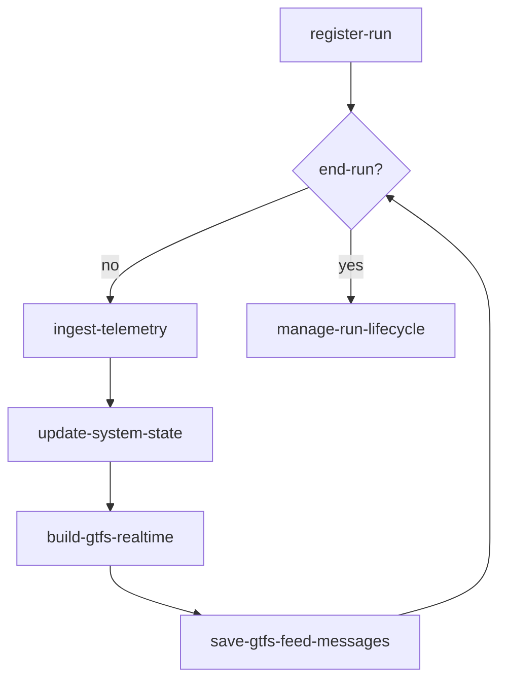

# Databús System Processes

> Ground truth for all Databús process definitions. Each process is specified as a state machine with states, events, and actions. YAML DSL (Domain Specific Language) files in `yaml/` are the canonical source, whereas JSON files in `json/` are XState-compatible derivatives.

## Naming Conventions

| Layer | Case | Pattern | Example |
|---|---|---|---|
| Services (actors) | `snake_case` | `databus.<service>` | `databus.realtime_engine` |
| Processes (machines) | `kebab-case` | `databus.<process>` | `databus.register-run` |
| States | `snake_case` (usually one word) | `databus.<process>.<state>` | `databus.register-run.waiting` |
| Events | `SCREAMING_SNAKE_CASE` | `databus.<service>.<EVENT>` | `databus.backend.RUN_SUBMISSION_REQUESTED` |
| Messages (AMQP) | `camelCase` | `databus.<messageName>` | `databus.runSubmissionRequest` |
| Actions (functions) | `snake_case` | `databus.<service>.<action>` | `databus.realtime_engine.write_run_metadata` |

[**OPTIONAL**] Everything is namespaced under `databus.`.

## Processes

- `register-run`: `backend` → `realtime_engine`
- `ingest-telemetry`: `telemetry_broker` → `realtime_engine`
- `update-system-state`: `realtime_engine` → `state`
- `build-gtfs-realtime`: `scheduler` → `tasks`
- `save-gtfs-feed-messages`: `tasks` → `store`
- `end-run`: `backend` ↔ `realtime_engine` (bidirectional trigger)
- `manage-run-lifecycle`: `realtime_engine` → `store`

### Flow Chart



## Filesystem

```
yaml/                         # YAML DSL
  register-run.yaml
  end-run.yaml
  ingest-telemetry.yaml
  ...
json/                         # XState JSON 
  register-run.json
  ingest-telemetry.json
  end-run.json
  ...
docs/                         # Full reference per process
  register-run.md
  ingest-telemetry.md
  end-run.md
  ...
```


## Notes
- `realtime_engine` is the only service authorized to write to `state` (Redis).
- `register-run` must be processed sequentially.
- `manage-run-lifecycle` has two options (final flush vs. continuous accumulation) — decision pending.
- Event publication requires retry logic for reliability and consistency — see [Tenacity](https://tenacity.readthedocs.io/en/latest/).
