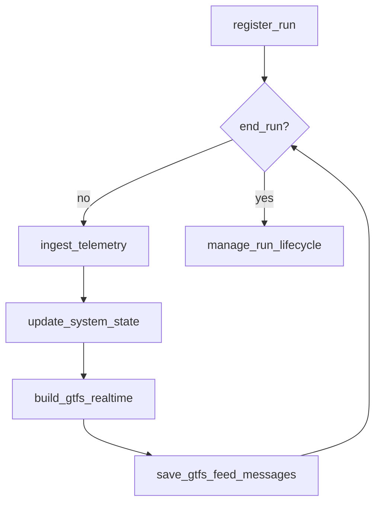
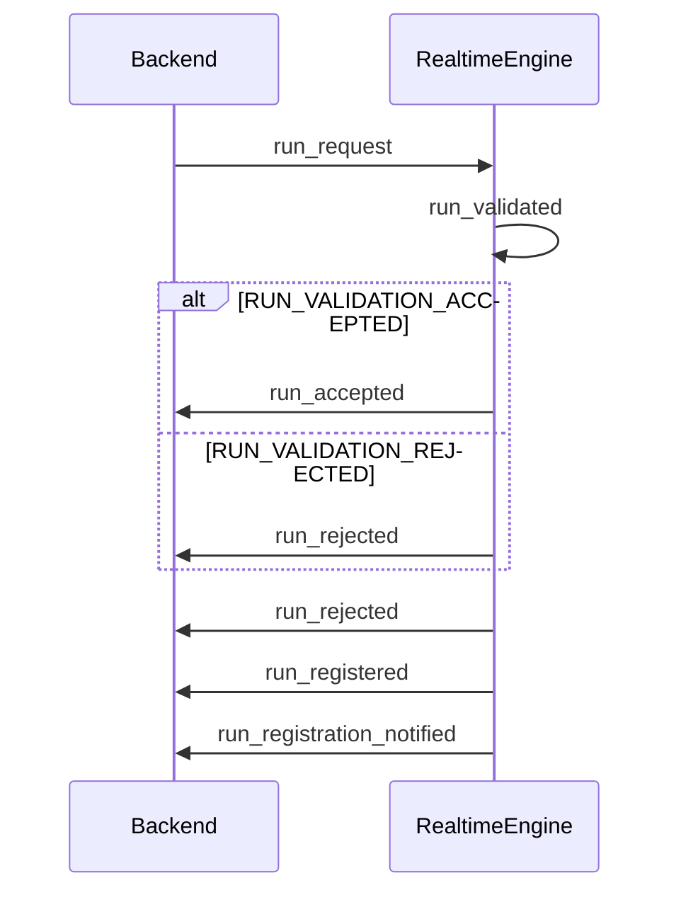

# Something

## Processes

- `register_run`: from `backend` to `realtime_engine`
- `ingest_telemetry`: from `telemetry_broker` to `realtime_engine`
- `update_system_state`: from `realtime_engine` to `state`
- `build_gtfs_realtime`: from `tasks` (build GTFS Realtime feed and publish to stable URL)
- `save_gtfs_feed_messages`: from `tasks` (save to Parquet)
- `end_run`: from `backend` to `realtime_engine` or from `realtime_engine` to `backend` (depends on the trigger)
- `manage_run_lifecyle`: from `realtime_engine` (store the run "traces" in `store` (PostgreSQL)) 

### Events

#### `register_run`

States:

- `waiting`
    - RUN_REQUESTED (when `backend` gets an API call to register a run)
- `requesting`
    - RUN_VALIDATION_REQUESTED (when `backend` sends a message to `realtime_engine` to validate the run request)
- `validating` (confirms if the run is valid or not)
    - RUN_ACCEPTED (when `realtime_engine` accepts the run request)
    - RUN_REJECTED (when `realtime_engine` rejects the run request)
- `initializing` (prepares the stuff)
    - RUN_INITIALIZED (when `realtime_engine` registers the run in the system)
- `notifying`
    - RUN_VALIDATION_NOTIFIED (when `backend` notifies the clients the request result)

Events:

- RUN_REQUESTED (`backend`)
    - Message model from `backend` to `realtime_engine`: `run_request` (AsyncAPI)
- RUN_VALIDATION_REQUESTED (`realtime_engine`)
    - Message model from `realtime_engine`: `run_validated` (AsyncAPI)
- RUN_REJECTED (`realtime_engine`)
    - Message model from `realtime_engine` to `backend`: `run_rejected` (AsyncAPI)
- RUN_ACCEPTED (`realtime_engine`)
    - Message model from `realtime_engine` to `backend`: `run_accepted` (AsyncAPI)
- RUN_INITIALIZED (`realtime_engine`)
    - Message model from `realtime_engine` to `backend`: `run_registered` (
- RUN_REGISTRATION_NOTIFIED (`realtime_engine`)
    - Message model from `backend`: `run_registration_notified` (AsyncAPI)

Notes to self:

- Event messages publication requires a retry logic in case of failure, to ensure the system's reliability and consistency. Check [Tenacity](https://tenacity.readthedocs.io/en/latest/).
- `run_initialization` triggers loading of all data related to the run, such as trip_id, vehicle_id, etc. to `state` (Redis)
- `run_execution`: triggers the registration of the run in the list of active runs in `state` (Redis)

## Comments about the services

### `realtime_engine`

- Only authorized to update the system state

STATE_UPDATED