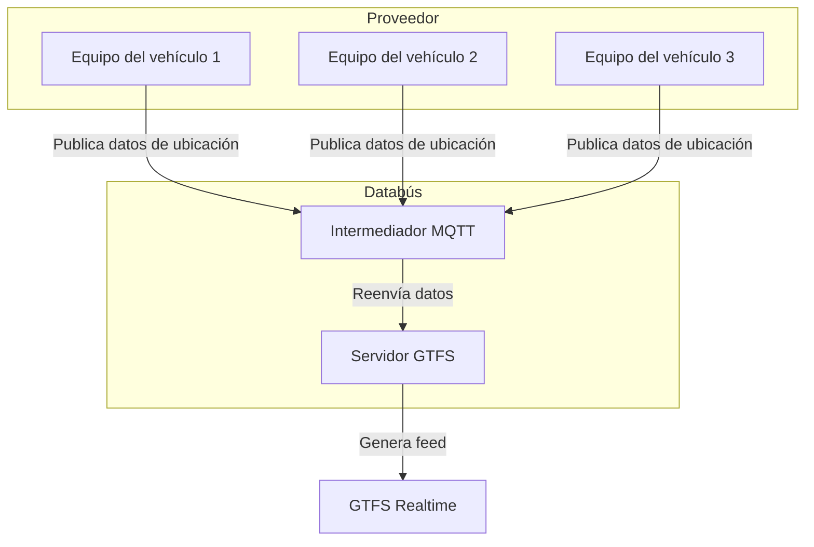
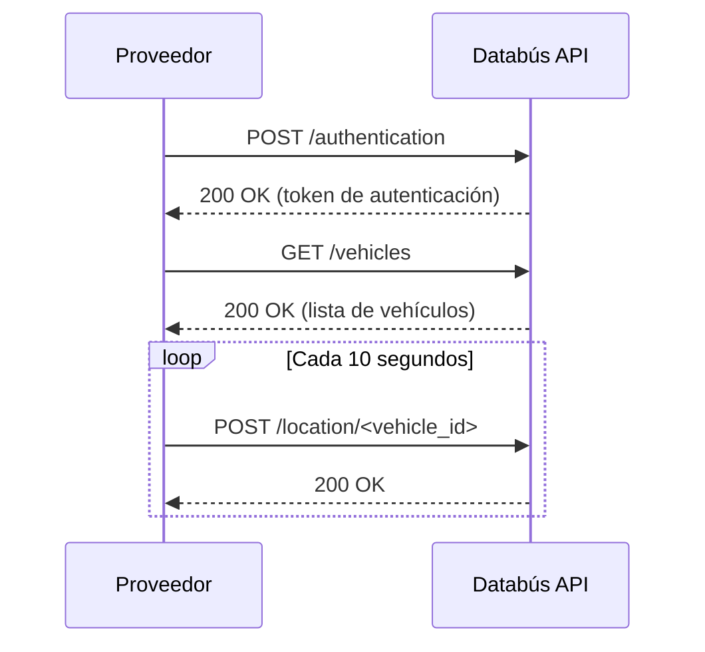
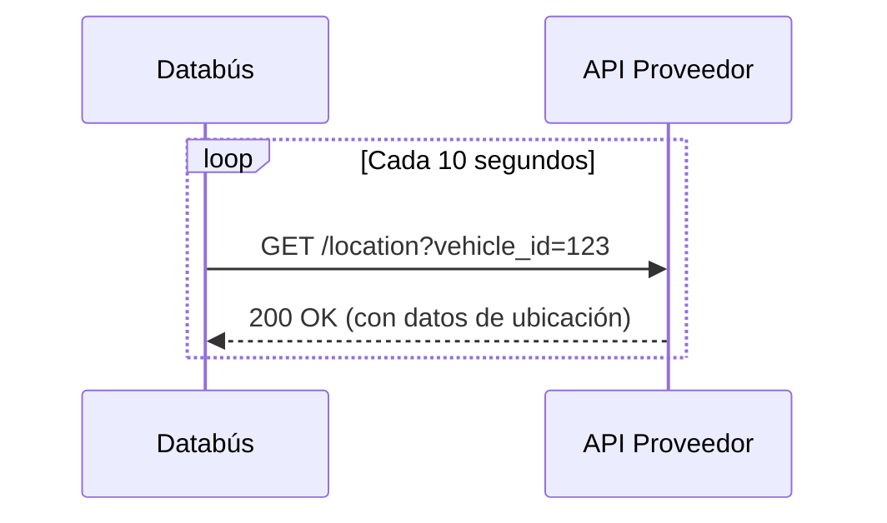

# Métodos de ingesta de datos de ubicación de vehículos para un servidor en tiempo real GTFS

**Laboratorio de Sistemas Inteligentes de Movilidad (SIMOVI)**

_Marzo 2026_

Databús es un sistema de procesamiento de datos de transporte público en tiempo real que genera un _feed_ de datos GTFS en tiempo real (GTFS Realtime) a partir de la ubicación de los vehículos y otros datos de telemetría. Para lograr esto, es necesario que los proveedores de transporte público envíen datos de ubicación de sus vehículos a Databús. A continuación, se describen los métodos recomendados para la ingesta de estos datos.

## Intermediador MQTT

> Método recomendado

Modelo de comunicación publicación/suscripción donde el equipo del vehículo, con conectividad celular, envía nuevos datos de ubicación cada vez que están disponibles, con una frecuencia recomendada menor a 10 segundos.



El mensaje es enviado a la siguiente URL, siguiendo el protocolo MQTT (_Message Queuing Telemetry Transport_):

```http
mqtts://broker.databus.ucr.ac.cr:8883
```

El esquema de datos por enviar es el siguiente:

```json
{
  "latitude": 0.0,
  "longitude": 0.0,
  "timestamp": "2026-03-10T07:53:00Z"
}
```

El tópico (_topic_) de MQTT para publicar estos datos de ubicación es:

```
transit/vehicles/<vehicle_id>/location
```

donde `<vehicle_id>` es el identificador único del vehículo (generalmente la placa del bus).

Este método es recomendado por las características de MQTT, que es un protocolo ligero y eficiente para la transmisión de datos en tiempo real, especialmente en entornos con conectividad limitada o intermitente.

## Databús API

> Segundo método recomendado (respaldo)

En este caso el proveedor tiene acceso a Databús API, específicamente al punto terminal (_endpoint_) `/location`, donde envía periódicamente la ubicación, siguiendo el siguiente esquema de datos (ejemplo):

```json
{
  "vehicle_id": "string",
  "latitude": 0.0,
  "longitude": 0.0,
  "timestamp": "2026-03-10T07:53:00Z"
}
```



Por la naturaleza de la conexión, este método es menos eficiente que el uso de MQTT, ya que implica una conexión HTTP para cada actualización de ubicación, lo que puede generar mayor latencia y consumo de recursos. Sin embargo, es una opción viable como respaldo en caso de que el método MQTT no sea factible para el proveedor.

Su ventaja es que Databús API está diseñado para gestionar estos datos de ubicación, por lo que puede ofrecer funcionalidades adicionales como validación de datos, autenticación y manejo de errores de manera más robusta.

## API del proveedor

El proveedor habilita el acceso de lectura al sistema Databús para hacer _polling_ (consulta periódica) de la ubicación de los vehículos que están actualmente en una carrera (viaje).

Por ejemplo:



La respuesta debe incluir al menos la ubicación actual del vehículo y marca temporal de la medición del último dato registrado, siguiendo el mismo esquema de datos mencionado anteriormente.

En este escenario, es necesario llegar acuerdos técnicos sobre las características de la API del proveedor, como el formato de los datos, la frecuencia de actualización y los mecanismos de autenticación.
