# A Natural Language Interface for Passenger Information Systems in Public Transportation

## Abstract

Information for public transportation users is an essential element for promoting its use and improving satisfaction with the service. In the era of digitalization, public transportation services must provide timely information through multiple interfaces or "touchpoints" with their users, and generative artificial intelligence tools—particularly large language models (LLMs)—offer unprecedented opportunities to modernize and facilitate access to any necessary information using natural language in unstructured queries, in virtually any language.

This article proposes the design and a prototype of a new generative AI chat interface for querying public transportation services, built with the Model Context Protocol (MCP)—an open standard for providing contextual information to language models—in conjunction with the Infobús® API, a data source based on GTFS, the specification for sharing public transportation open data. This is part of the pilot plan of the *b*UCR information system of the University of Costa Rica. The result demonstrates the potential of this application and its advantages in accessibility, usability and versatility.

## Introduction

Large language models (LLMs) are revolutionary for their capacity to understand language and reason, making them essential tools for information search and synthesis. However, this technology has limitations when it comes to providing up-to-date or real-time data (Lewis et al., 2020). This is due to the nature of their models, which are necessarily limited by the snapshot of information available at the time of training the foundation models. For example, OpenAI's GPT-4o only includes data up to September 30, 2023, as per their website.

However, emerging protocols allow LLMs to interact with new data sources, such as local documents or APIs where data can be fetched (Hou et al., 2025). This grants them new capabilities to answer questions with the latest data or even perform transactions with other systems—turning them effectively into _AI agents_, that is, entities capable of interacting with and acting upon their environment following natural language instructions.

The Model Context Protocol (MCP) is an open standard developed by Anthropic—one of the leading actors in AI research and development today—designed to provide _context_ to LLM responses. According to their vision, "MCP provides a standardized way to connect AI models with different data sources and tools."

In public transportation information systems, this opens a valuable opportunity to qualitatively transform how users interact with service data (Da et al., 2025). The General Transit Feed Specification (GTFS) exposes nearly all the data needed to use the service effectively (Mobility Data, 2022), but this data is difficult for humans to explore and understand, requiring interfaces that simplify its interpretation. While specialized trip planners like Google Maps and Transit App already serve this purpose, natural language interfaces would be even more accessible to a broader audience and may allow faster, more flexible queries.

This article presents a chat interface that accepts natural language queries, processes them to retrieve data through MCP from the Infobús® web API—developed in Abarca et al. (2024a)—and returns the results as natural language responses with real-time or updated information. The MCP server is available on GitHub at https://github.com/simovilab/infobus-mcp, referred to here as Infobús MCP. The web API documentation is available at https://infobus.bucr.digital/api/docs.

TransitGPT (Devunuri et al., 2024) is an example of a pioneering system with similar goals but based on an _ad hoc_ implementation. Other LLMs have also been evaluated for interpreting public transport data (Ying et al., 2025), but they do not use direct data links as MCP allows in this proposal.

Section 2 presents the design principles and chosen technologies, Section 3 details the MCP server structure, Section 4 describes the tools needed to take full advantage of the pilot system data, Section 5 shows evidence of the prototype's functionality, and the conclusions follow.

## Methodology

The proposal is developed following the same principles presented in Abarca et al. (2024b) and Abarca et al. (2024c), which aim for interoperability—to ensure compatibility with international standards and architectures. This is why MCP was chosen as the platform. It also promotes technological neutrality to avoid vendor lock-in. Although MCP was developed by Anthropic, it does not restrict the choice of language model providers, as long as they support MCP. OpenAI, Google, Meta, among others, are already developing software development kits (SDKs) for this purpose. Finally, it seeks information unity from the user's perspective to avoid fragmentation and data inconsistency. In Costa Rica, this lack is critical (Abarca et al., 2024d). The goal of the pilot plan is to unify this information. All these principles support the choice of MCP as the context management platform for the intended application.

This article presents the results of a prototype chat service with a local client and an MCP server implementing the `get-next-trip` tool, to provide passenger information via web chat or other communication channels.

Tests were conducted using Anthropic's Claude Desktop client and a server implemented in Python using the `mcp` SDK (available at https://pypi.org/project/mcp/), and the `httpx` package to run a local test server.

### About the Infobús Web API

The Infobús® web API is proposed in Abarca et al. (2024a). It is a data provider for public transportation information services such as websites, digital signage, mobile apps, chatbots, and more, based on GTFS but also aggregating additional data (e.g., weather, local emergencies).

Examples provided are from the pilot plan for the campus bus system at the University of Costa Rica (UCR), developed by the Intelligent Mobility Systems Lab (SIMOVI) of the School of Electrical Engineering and the General Services Office (OSG), in partnership with other internal and external entities.

The prototype uses the `next-trips/` endpoint, whose parameters are listed in Table 1.

**Table 1: Query parameters for `next-trips/` in the Infobús API.**

| Parameter   | Type     | Example               | Description                                                                        |
| ----------- | -------- | --------------------- | ---------------------------------------------------------------------------------- |
| `stop_id`   | _string_ | `bUCR_0_03`           | Query for upcoming trips at a specific stop with given ID.                         |
| `route_id`  | _string_ | `L1`                  | Filter upcoming trips by both stop and route with given ID.                        |
| `timestamp` | _string_ | `2024-07-31T16:12:25` | Reference date and time in the future to retrieve trips starting from that moment. |

The response fields of the endpoint are listed in Table 2.

**Table 2: Fields in the 200 OK response from `next-trips/` in the Infobús API.**

| Parameter                                                               | Type      | Description                                   |
| ----------------------------------------------------------------------- | --------- | --------------------------------------------- |
| `stop_id`                                                               | _string_  | Stop ID according to GTFS.                    |
| `timestamp`                                                             | _string_  | Time for querying upcoming trips.             |
| `next_arrivals` [                                                       | **array** | Data for each upcoming arrival                |
| &nbsp;&nbsp;&nbsp;&nbsp;`trip_id`                                       | _string_  | Trip identifier from the GTFS Schedule        |
| &nbsp;&nbsp;&nbsp;&nbsp;`route_id`                                      | _string_  | Route identifier from the GTFS Schedule       |
| &nbsp;&nbsp;&nbsp;&nbsp;`route_short_name`                              | _string_  | Short name of the route                       |
| &nbsp;&nbsp;&nbsp;&nbsp;`route_long_name`                               | _string_  | Long name of the route                        |
| &nbsp;&nbsp;&nbsp;&nbsp;`trip_headsign`                                 | _string_  | Destination of the trip                       |
| &nbsp;&nbsp;&nbsp;&nbsp;`wheelchair_accessible`                         | _string_  | Wheelchair accessibility                      |
| &nbsp;&nbsp;&nbsp;&nbsp;`arrival_time`                                  | _string_  | Arrival time at the stop                      |
| &nbsp;&nbsp;&nbsp;&nbsp;`departure_time`                                | _string_  | Departure time from the stop                  |
| &nbsp;&nbsp;&nbsp;&nbsp;`in_progress`                                   | _boolean_ | If the trip is currently in progress          |
| &nbsp;&nbsp;&nbsp;&nbsp;`progression` [                                 | **array** | Data about the ongoing trip                   |
| &nbsp;&nbsp;&nbsp;&nbsp;&nbsp;&nbsp;&nbsp;&nbsp;`position_in_shape`     | _float_   | Percentage progress along the trip's shape    |
| &nbsp;&nbsp;&nbsp;&nbsp;&nbsp;&nbsp;&nbsp;&nbsp;`current_stop_sequence` | _integer_ | Current stop sequence number                  |
| &nbsp;&nbsp;&nbsp;&nbsp;&nbsp;&nbsp;&nbsp;&nbsp;`current_status`        | _string_  | Vehicle's current status relative to the stop |
| &nbsp;&nbsp;&nbsp;&nbsp;&nbsp;&nbsp;&nbsp;&nbsp;`occupancy_status`      | _string_  | Vehicle occupancy status                      |
| &nbsp;&nbsp;&nbsp;&nbsp;]                                               |           |                                               |
| ]                                                                       |           |                                               |

## MCP Server Structure

The prototype's basic architecture is shown in Figure 1, which includes the MCP client -- Claude Desktop for this test -- the MCP server and the API with GTFS data.

The server queries the `next-trips/` endpoint of the Infobús API and constructs a simplified, natural-language-based response (in English) suitable for LLM consumption, avoiding complex GTFS syntax and data relations. The LLM uses this context to provide a rich answer in the chat, including derived insights such as estimated headways (the period between arrivals), which are not explicitly provided by the API, thus augmenting the answer.

**Figure 1: Basic architecture of the MCP server to collect information from the Infobús® API via an MCP-compatible LLM client, using the tools `get-next-trips` and others.**

```mermaid
graph LR
    C[💻<br/>MCP Client]
    S[🖥️<br/>MCP Server]
    A[🗃️<br/>API]

    C <--> |MCP Protocol| S
    S <--> |🔧 get-next-trips| A
    S <--> |🔧 get-stops| A
    S <--> |🔧 get-calendar| A
    S <--> |🔧 get-routes| A
```



## Tool Design

According to the definition in Abarca et al. (2024b), public transport information systems are a set of communication channels and technologies that allow users to understand the service details necessary for effective usage. Based on GTFS, which is a globally recognized standard, the cited reference proposes that such systems should provide information in at least seven categories. Based on this, we describe the tools needed to provide a sufficiently rich context for LLM queries in the chat, aiming to fulfill the passenger's information requests.

- **Agency**

  - 🔧 **Tool:** `get-agency`
  - 🔗 **Endpoint:** `agency/`
  - 📄 **Description:** Contact details and customer service channels for a given agency, enabling faster communication with passengers

- **Routes**

  - 🔧 **Tool:** `get-routes`
  - 🔗 **Endpoint:** `routes/`
  - 📄 **Description:** Codes, names, descriptions, and colors for identification of routes, providing quick access to the system's operational design

- **Stops**

  - 🔧 **Tool:** `get-stops`
  - 🔗 **Endpoint:** `stops/`, `route-stops/`
  - 📄 **Description:** Location, infrastructure, amenities, safety, and accessibility for each stop, facilitating access to data that could improve accessibility to physical infrastructure

- **Trips and Schedules**

  - 🔧 **Tool:** `get-next-trips`
  - 🔗 **Endpoint:** `next-trips/`
  - 📄 **Description:** Departure times for each trip and stop in a given route and day of the week, providing key information for everyday use of the service and trip planning

- **Operating Days**

  - 🔧 **Tool:** `get-calendar`
  - 🔗 **Endpoint:** `calendar/`, `calendar-dates/`
  - 📄 **Description:** Weekly and seasonal schedules, holiday adjustments and other calendar-related information, particularly important for days-ahead trip planning

- **Fares**

  - 🔧 **Tool:** `get-fares`
  - 🔗 **Endpoint:** `fare-rules/`, `fare-attributes/`
  - 📄 **Description:** Price details, payment and purchase methods

- **Maps and Geospatial Data**
  - 🔧 **Tool:** `get-maps`
  - 🔗 **Endpoint:** `geo-shapes/`, `geo-stops/`
  - 📄 **Description:** Route maps and stop locations, useful for geocoding and localized data

## Results and Analysis

Tests show that queries can be made in virtually any language, and the LLM is capable of interpreting complex queries, breaking them down into one or more API requests using the available tools. Figures 2a and 2b show responses in French and Japanese, respectively, from the Claude Desktop client.

**Figure 2: Schedule queries in different languages for different times.**

_Note: Figure 2a shows a query made in French, and Figure 2b shows a query made in Japanese. These would be represented as images in the original document._

Claude Desktop—and likely other LLMs of similar capacity—can transform natural language queries into the necessary parameters for API calls.

For instance, below is the definition snippet for the `get-next-trips` tool:

```python
@mcp.tool()
async def get_next_trips(stop_id: str, timestamp: str) -> str:
    """Get next trips for a given bus stop in a given day and time.

    Args:
        stop_id: GTFS stop ID
        timestamp: Timestamp in ISO 8601 format (YYYY-MM-DDTHH:MM:SS)
    """
    url = f"{INFOBUS_API_BASE}/next-trips/"
    params = {
        "stop_id": stop_id,
        "timestamp": timestamp,
    }
    ...
```

The `timestamp` argument uses ISO 8601 format. When a user asks something like "What's the next bus at stop X tomorrow at noon?", Claude correctly infers the date and time as, for example, 2024-03-10T07:53:00 and performs the API call using the provided MCP `get_next_trips` tool.

## Conclusions

1. Using the Model Context Protocol (MCP), it is possible to develop tools that provide contextual information about public transportation services to an arbitrary LLM client (as long as it supports MCP).

2. The Infobús® web API provides GTFS data with enough flexibility to answer common user questions via MCP and natural language interaction.

3. Public transportation accessibility and usability can be positively impacted through extended use of tools like the one proposed here. The prototype should evolve through iterative testing with real users to assess suitability.

4. The potential for applications like this remains largely unexplored, due to the recent release of MCP and its gradual adoption by major AI players. However, it promises a revolution in real-time data access—perfectly suited to public transportation.

## Bibliography

_Note: The original document references a bibliography file (referencias.bib) that would contain the full citation details for all references mentioned in the text._
